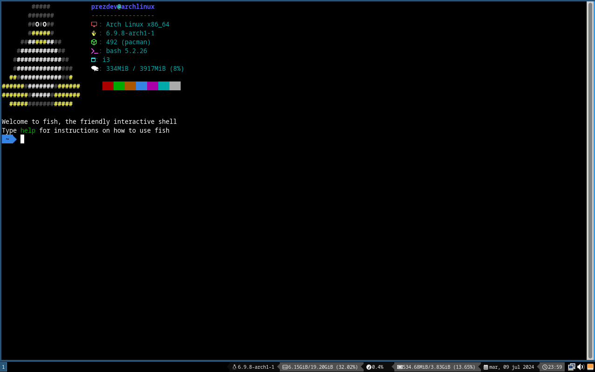

# AutoArch Bootstrap

AutoArch Bootstrap is an installation script for Arch Linux designed to set up your system quickly, including the i3 window manager. This script is intended for a fresh and clean installation of Arch Linux.

## Installation
### Installation using Git

First, ensure you have git installed:

```bash
sudo pacman -Sy --noconfirm git
```

Then, clone the repository and run the installation script:

```bash
git clone https://github.com/prezdev88/autoarch-bootstrap.git && cd autoarch-bootstrap && ./install
```

### Fast installation

If you prefer a quick installation, use the following command to download and run the installation script directly:

```bash
curl --output install https://raw.githubusercontent.com/prezdev88/autoarch-bootstrap/master/get && chmod +x install && ./install
```

# Screenshots
## Login


## Desktop


## Terminal

